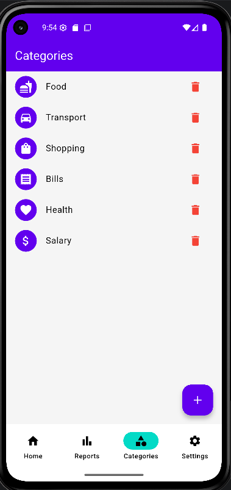
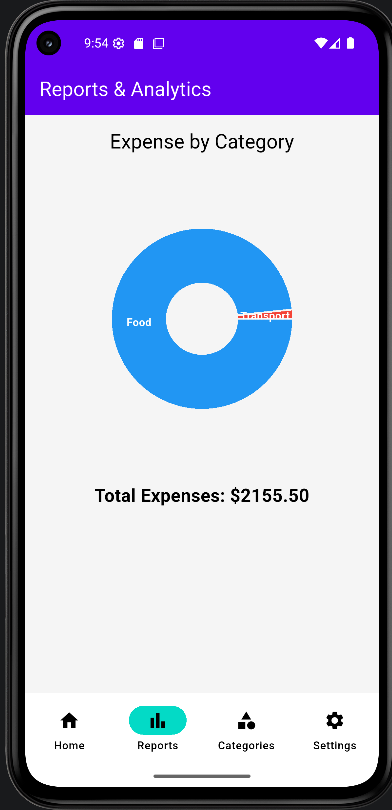
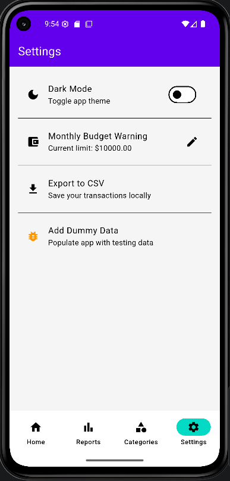

# Smart Expense Tracker

A beautiful Flutter-based expense tracking app with Hive local database, MVVM architecture, dark mode, budget tracking, reports with pie charts.


## ✨ Features

- Add, Edit & Delete Transactions (Income & Expense)
- Categories Management (Default + Custom)
- Dashboard with Total Balance, Income & Expenses
- Recent Transactions Overview
- Reports & Analytics with Pie Chart
- Search & Filter Transactions (Today, This Week, This Month)
- Monthly Budget Tracking
- Dark / Light Theme Toggle
- Add Dummy Data for Testing
- Fully Offline using Hive Database

## 🏗️ Architecture

**MVVM Pattern** with Provider state management

- **Models**: `TransactionModel`, `CategoryModel`
- **Repositories**: Transactions, Categories, Settings, Budget
- **ViewModels**: TransactionViewModel, CategoryViewModel, SettingsViewModel
- **Local Storage**: Hive (`transactionsBox`, `categoriesBox`, `settingsBox`, `budgetBox`)

## 📱 Screenshots

### Dashboard


### Categories Screen


### Reports / Analytics


### Settings



## 📦 Dependencies

```yaml
dependencies:
  flutter:
    sdk: flutter
  provider: ^6.1.2
  hive: ^2.2.3
  hive_flutter: ^1.1.0
  path_provider: ^2.1.4
  uuid: ^4.5.1
  intl: ^0.19.0
  fl_chart: ^0.70.0
```

### 👤 Author & Contact

<div align="center">

### **MaryamAppDev**
[](https://github.com/MaryamAPPDev)


